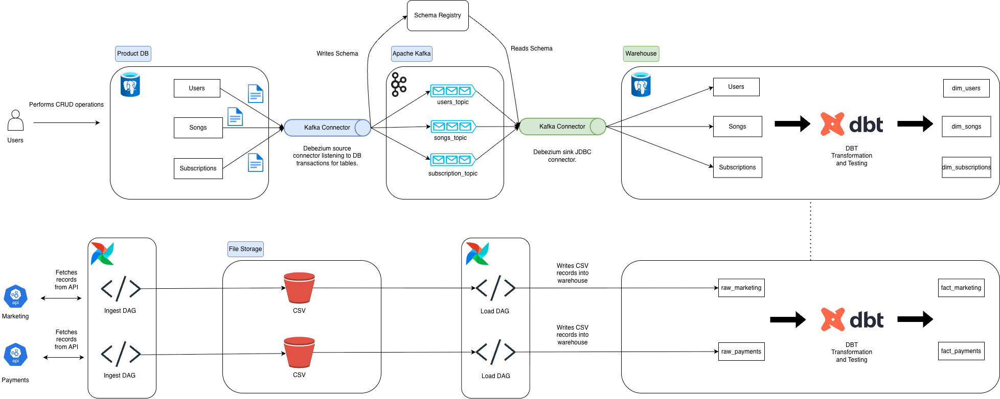

# Singa Home Assignment

## Architecture Overview



The diagram illustrates the end-to-end data pipeline used for this assignment. It shows how data flows from
- **simulation scripts** (users, songs, subscriptions) and **API emulators** (marketing, payments) into temporary storage,
- through **Debezium** CDC into a warehouse database,
- and the role of Airflow for orchestration and dbt for transformations.

Key architectural principles:

- **Decoupled ingestion and loading**: generation of source files and their subsequent ingestion into Postgres are handled by separate Airflow DAGs, enabling independent scheduling, backfills, and easier troubleshooting.
- **Parametrized tasks with idempotency**: loader DAGs use the execution date (`ds`) to target specific partitions and check for existing data before inserting, ensuring upsert behavior and preventing duplicates.

## Folder Contents
1.  `airflow`: Contains the DAGs for ingesting data (emulating API fetch response from Marketing and Payment), loading the data into Postgres DB (which is acting as data warehouse), and for running the dbt models followed by dbt tests.
2.  `scripts`: Contains python scripts (containerised) that emulate the normal DB operations for `users`, `songs`, `subscriptions`. The operations include CRUD (create, read, update, and delete) at different frequencies for each operation to emulate rela life DB transactions.
3.  `singa_analytics`: Contains folders for dbt.
4.  `singa_analytics/models/staging`: dbt folder to host staging tables like, `dim_users` to perform basic column renaming, or casting, or include/exclude.
5.  `singa_analytics/models/marts/cost_per_user.sql`: The raw SQL queries used for cost per user.
6.  `singa_analytics/models/marts/new_paying.sql`: The raw SQL queries used for cost new paying customers.
7.  `singa_analytics/models/*.yml`: YAML files to host dbt tests such as `unique`, `not_null` and others.
8.  `dummy_s3`: Acts as storage for hosting the CSV files for the API responses.
9.  `debezium`: Contains `.sh` scripts for setting up kafka connectors, necessary for CDC repliation of DB tables into warehouse.

## How to Run the Pipeline
This pipeline uses Python and DuckDB (an SQL OLAP database).

1.  **Install Docker:**

2.  **Run with Docker:**
    ```bash
    docker compose up --build -t
    ```
1.  **Output:**
    *   Spins up Airflow server, Postgres DB (application-db), Postgres DB (warehouse-db), debezium (cdc), python containers to emulate CRUD operations
    *   Generates csv files in dummy_s3 for marketing, and payments
    *   Loads the csv files into warehouse DB
    *   Actively replicates the application-db into warehouse-db
    *   Runs dbt transformation to populate business consumable tables